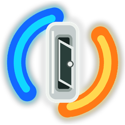
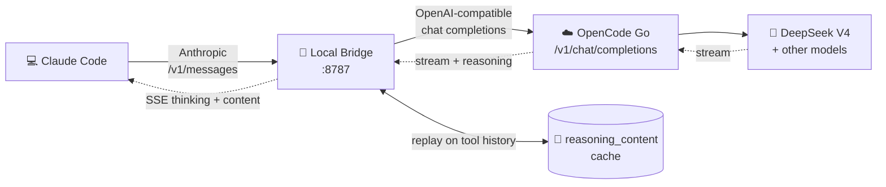

<div align="center">



# DeepSeek V4 OpenCode Claude Code Bridge

**Drop-in local bridge that lets Claude Code drive OpenCode Go's DeepSeek V4 — with full `reasoning_content` replay for thinking-mode tool calls.**

[](LICENSE)
[](package.json)
[](#-requirements)
[](package.json)
[](package.json)
[](https://github.com/superheroYu/deepseek-v4-opencode-claude-code-bridge)

[English](README.md) · [简体中文](README.zh-CN.md)

</div>

---

Claude Code speaks Anthropic `/v1/messages`. OpenCode Go exposes DeepSeek V4 through OpenAI-compatible `/v1/chat/completions`. This bridge translates between the two protocols **and** preserves the DeepSeek `reasoning_content` history required for thinking-mode tool calls.

> [!NOTE]
> Other OpenCode Go `/v1/chat/completions` models may also work, but they are best-effort/experimental — their tool-calling behavior can differ from DeepSeek V4.

---

## 📑 Table of Contents

- [🔄 How It Works](#-how-it-works)
- [✅ Current Scope](#-current-scope)
- [🎯 Why Not a General Gateway?](#-why-not-a-general-gateway)
- [⚖️ Compared With oc-go-cc](#%EF%B8%8F-compared-with-oc-go-cc)
- [📋 Requirements](#-requirements)
- [⚙️ Configuration](#%EF%B8%8F-configuration)
- [🚀 Start](#-start)
- [🔧 Autostart](#-autostart)
- [🛠️ Claude Code Settings](#%EF%B8%8F-claude-code-settings)
- [🩺 Health Check](#-health-check)
- [📊 Usage Reporting](#-usage-reporting)
- [🧪 Development Checks](#-development-checks)
- [🐛 Troubleshooting](#-troubleshooting)
- [🔒 Security Notes](#-security-notes)
- [📜 Conversation Compaction](#-conversation-compaction)
- [💡 Why This Exists](#-why-this-exists)
- [📚 OpenCode Go Notes](#-opencode-go-notes)
- [🔗 References](#-references)

---

## 🔄 How It Works



The bridge translates:

| Anthropic Messages API | ⇄ | OpenAI-compatible Chat Completions |
| --- | :---: | --- |
| `messages[].content` (text / `tool_use` / `tool_result`) | → | `messages` with `role=user/assistant/tool` |
| `tools[{ name, description, input_schema }]` | → | `tools[{ type: "function", function: { name, description, parameters } }]` |
| `tool_choice` | → | softened to system instruction when needed |
| SSE `message_*` / `content_block_*` events | → | streaming chat completion chunks |

For DeepSeek V4, it also preserves `reasoning_content` for thinking-mode tool calls. DeepSeek requires reasoning content to be sent back in later tool-call history. The bridge stores it in a local cache so continued Claude Code sessions do not fail with `reasoning_content must be passed back`.

---

## ✅ Current Scope

<table>
<tr>
<th width="50%">✅ Supported</th>
<th width="50%">❌ Not Targeted</th>
</tr>
<tr>
<td valign="top">

- Claude Code `/v1/messages` non-streaming + streaming
- Text content
- Claude Code tool calls and tool results
- OpenAI-compatible function calling
- DeepSeek V4 `reasoning_content` replay for tool-call history
- **Verified**: OpenCode Go DeepSeek V4 Pro & Flash
- **Experimental**: other OpenCode Go `/v1/chat/completions` models
- Windows, Linux, macOS (Node.js)

</td>
<td valign="top">

- Image, audio, prompt caching, Anthropic beta fields
- Forced `tool_choice` (softened to system instruction)
- DeepSeek reasoning replay for non-DeepSeek models (off by default)
- Anthropic-signed thinking blocks (empty `signature` is used)
- Full Anthropic API parity — this is a **compatibility bridge**

</td>
</tr>
</table>

---

## 🎯 Why Not a General Gateway?

General-purpose proxies (ccNexus, LiteLLM, New API, One API, …) are useful when you need multi-provider management, endpoint rotation, quota control, dashboards, virtual keys, or a unified OpenAI-compatible gateway. They are broader tools.

This project is intentionally narrower — it solves the specific protocol edge cases needed to run **OpenCode Go DeepSeek V4 as a Claude Code backend**.

| Area | General conversion gateways | **This bridge** |
| --- | --- | --- |
| 🎯 Primary goal | Route or normalize many providers and API formats | Make OpenCode Go DeepSeek V4 usable inside Claude Code |
| 📐 Scope | Broad multi-provider gateway behavior | Focused Anthropic Messages → OpenAI chat-completions bridge |
| 🧠 DeepSeek V4 `reasoning_content` replay | Not usually the central design goal | **Core feature** — local cache + replay |
| 💭 Claude Code thinking display | Depends on the gateway and model path | Converts DeepSeek reasoning deltas → Anthropic-compatible thinking blocks |
| 🔧 Tool-call history | Generic tool schema conversion | Preserves/reconstructs DeepSeek reasoning for Claude Code tool-call history |
| 🔀 Forced `tool_choice` | Often translated directly to OpenAI forced tool choice | Softened for DeepSeek/OpenCode Go compatibility when needed |
| 📦 Deployment | Often a full gateway with management features | Single **zero-dependency** Node.js local bridge |

The practical advantage is not that this bridge is more universal — it's that it handles DeepSeek V4's less common requirements:

- **🔁 Reasoning replay** — DeepSeek thinking-mode tool-call history may require previous `reasoning_content` to be sent back. The bridge caches and replays it by tool call ID, assistant text hash, and recent tool context.
- **🗜️ Claude Code compaction survival** — when Claude Code keeps recent tool-call blocks across compaction, the bridge can still recover matching DeepSeek reasoning from the local cache.
- **👀 Visible thinking** — streaming DeepSeek `reasoning_content` is exposed to Claude Code as `thinking` content blocks so the UI can show it.
- **🧩 DeepSeek-aware extensions** — `thinking` and `reasoning_effort` are only sent to DeepSeek model names, so experimental non-DeepSeek chat-completions models are not polluted with DeepSeek-specific fields.
- **🏷️ OpenCode Go model IDs** — the default config follows OpenCode Go's DeepSeek V4 model IDs, including `deepseek-v4-pro[1m]` and `deepseek-v4-flash`.

> [!TIP]
> Use a **general gateway** if you mainly need provider aggregation, team management, key rotation, or a dashboard.
> Use **this bridge** if your main problem is: *"Claude Code cannot reliably use OpenCode Go DeepSeek V4, especially after tool calls or thinking-mode history."*

---

## ⚖️ Compared With oc-go-cc

[`oc-go-cc`](https://github.com/samueltuyizere/oc-go-cc) is closer to this project than broad gateways: it is also an OpenCode Go → Claude Code proxy, and it also translates Anthropic Messages requests to OpenAI-style chat-completions requests.

The main difference is **focus**:

| | [`oc-go-cc`](https://github.com/samueltuyizere/oc-go-cc) | **This bridge** |
| --- | --- | --- |
| 🎯 Best for | Broader OpenCode Go backend manager — model routing, fallback chains, token thresholds, packaged CLI/background operation, wider model coverage | Solving DeepSeek V4's `reasoning_content must be passed back` after tool calls, continued sessions, or Claude Code history compaction |
| 💾 Reasoning cache | Core thinking/reasoning protocol mapping | Persistent local `reasoning_content` cache + replay by tool call ID, assistant text hash, and recent tool context |
| 📦 Footprint | Wider feature surface | Zero-dependency Node.js, focused on DeepSeek V4 Pro/Flash, MIT licensed |

---

## 📋 Requirements

- **Node.js** 18 or newer
- An **OpenCode Go API key**
- **Claude Code**

> [!NOTE]
> No npm dependencies are required.

---

## ⚙️ Configuration

The repository includes a ready-to-use `config.json`. It does **not** contain any API key. Edit it only if you need a different port, upstream URL, model list, or reasoning cache path.

<details>
<summary><b>Default <code>config.json</code></b></summary>

```json
{
  "listen": {
    "host": "127.0.0.1",
    "port": 8787
  },
  "upstream": {
    "baseUrl": "https://opencode.ai/zen/go/v1"
  },
  "models": [
    "deepseek-v4-pro[1m]",
    "deepseek-v4-flash"
  ],
  "reasoningContent": "auto",
  "resolveThinkingConflict": true,
  "reasoningCacheMaxEntries": 0,
  "reasoningCacheMaxAgeMs": 2592000000,
  "reasoningCacheMaxSizeBytes": 209715200,
  "reasoningCachePath": "~/.claude/deepseek-v4-opencode-claude-code-bridge-reasoning-cache.json",
  "requestBodyLimitBytes": 104857600,
  "upstreamTimeoutMs": 600000
}
```

</details>

**Fields**

| Field | Description |
| --- | --- |
| `listen.host` | Local address to bind. Keep `127.0.0.1` unless you really want LAN access. |
| `listen.port` | Local proxy port. |
| `upstream.baseUrl` | OpenAI-compatible upstream base URL. For OpenCode Go: `https://opencode.ai/zen/go/v1`. |
| `models` | Model IDs returned by the local `/v1/models` endpoint. |
| `reasoningContent` | `auto`, `always`, or `never`. Keep `auto` for OpenCode Go — replays DeepSeek reasoning only for DeepSeek model names. |
| `resolveThinkingConflict` | `true` or `false`. When enabled, strips `thinking` from requests that also include `reasoning_effort` or `output_config.effort` to avoid DeepSeek's 400 error: *"thinking options type cannot be disabled when reasoning_effort is set"*. Claude Code 2.1.166+ sends both parameters together, causing this conflict — keep default `true`. |
| `reasoningCacheMaxEntries` | Max entries per reasoning cache bucket. `0` disables count-based trimming. |
| `reasoningCacheMaxAgeMs` | Max age since last use. Default `30 days`. `0` disables age-based trimming. |
| `reasoningCacheMaxSizeBytes` | Max serialized cache file size. Default `200 MB`. Oldest entries are removed first. |
| `reasoningCachePath` | Local DeepSeek reasoning cache path. |
| `requestBodyLimitBytes` | Max accepted request body size. Default `100 MB`. |
| `upstreamTimeoutMs` | Max wait for an upstream OpenCode Go request. Default `10 minutes`. |

> [!IMPORTANT]
> The default model uses the `deepseek-v4-pro[1m]` 1M-context variant. If your OpenCode Go plan does not include it, replace every `deepseek-v4-pro[1m]` value in `config.json` and Claude Code settings with `deepseek-v4-pro`.

---

## 🚀 Start

<details open>
<summary><b>Windows PowerShell</b></summary>

```powershell
npm start
```

</details>

<details>
<summary><b>Windows cmd</b></summary>

```cmd
start.cmd
```

</details>

<details>
<summary><b>Linux / macOS</b></summary>

```bash
chmod +x ./start.sh
./start.sh
```

</details>

> [!TIP]
> By default, the bridge receives the OpenCode Go key from Claude Code's `ANTHROPIC_API_KEY` request header. Keep the OpenCode Go key in **Claude Code settings**, not in `config.json`.

You can also pass a config path explicitly:

```bash
node server.js --config ./config.json
# or
CLAUDE_OPENCODE_PROXY_CONFIG=./config.json node server.js
```

---

## 🔧 Autostart

The repository includes user-level autostart helpers. They do **not** store API keys; the bridge still receives the OpenCode Go key from Claude Code requests.

<details>
<summary><b>🪟 Windows — Scheduled Task / Startup folder / Tray</b></summary>

<br/>

Windows first tries to use a per-user Scheduled Task that starts when the current user logs in. If Task Scheduler rejects the registration, the script falls back to a shortcut in the current user's Startup folder:

```powershell
powershell -NoProfile -ExecutionPolicy Bypass -File .\scripts\install-autostart-windows.ps1
```

If you already know Task Scheduler is blocked on your machine, use the Startup folder mode directly:

```powershell
powershell -NoProfile -ExecutionPolicy Bypass -File .\scripts\install-autostart-windows.ps1 -Mode StartupShortcut
```

In Startup folder mode, the script uses `nodew.exe` when available. If Node.js does not provide `nodew.exe`, it uses `wscript.exe` plus `scripts/start-hidden-windows.vbs` so the bridge runs in the background without a console window. This does not create a tray icon.

If you prefer a tray icon in the Windows notification area:

```powershell
powershell -NoProfile -ExecutionPolicy Bypass -File .\scripts\install-autostart-windows.ps1 -Mode StartupTray
```

The tray launcher provides a small menu for opening `/health`, trimming the reasoning cache to half of `reasoningCacheMaxSizeBytes`, restarting the bridge, or exiting it. Cache trimming stops the bridge first, edits the cache file, then starts the bridge again so the in-memory cache cannot overwrite the trimmed file. Restart and trim actions first ask the local bridge to shut down through its loopback-only `/shutdown` endpoint and only force-stop the child process if it does not exit in time. The trim action is handled by `scripts/trim-reasoning-cache.js`, so large cache files are parsed and written by Node.js instead of PowerShell. Its Windows tray icon is loaded from `assets/app-icon.ico` with `assets/app-icon.png` kept as the source PNG. The tray menu follows the current Windows app light/dark theme and uses a modern Segoe UI font when available.

Disable it with:

```powershell
powershell -NoProfile -ExecutionPolicy Bypass -File .\scripts\uninstall-autostart-windows.ps1
```

</details>

<details>
<summary><b>🐧 Linux — <code>systemd --user</code></b></summary>

<br/>

```bash
chmod +x ./scripts/*.sh
./scripts/install-autostart-linux.sh
systemctl --user status deepseek-v4-opencode-claude-code-bridge.service
```

Disable it with:

```bash
./scripts/uninstall-autostart-linux.sh
```

A user service normally starts after the user session exists. If you need it to start at boot before login, enable lingering manually:

```bash
sudo loginctl enable-linger "$USER"
```

If your upstream connection requires a proxy, run the install command from a shell that already has `HTTP_PROXY`, `HTTPS_PROXY`, `ALL_PROXY`, or `NO_PROXY` set. The Linux installer copies those proxy variables into the systemd user service and, on Node.js versions that support it, starts Node with `--use-env-proxy` so built-in `fetch` uses them. Proxy settings from `.bashrc`, `.zshrc`, or other interactive shell startup files are not automatically inherited by `systemd --user`.

</details>

<details>
<summary><b>🍎 macOS — user LaunchAgent</b></summary>

<br/>

```bash
chmod +x ./scripts/*.sh
./scripts/install-autostart-macos.sh
```

Disable it with:

```bash
./scripts/uninstall-autostart-macos.sh
```

</details>

To use a non-default config path, pass `-ConfigPath` on Windows or set `CONFIG_PATH` on Linux/macOS:

```powershell
.\scripts\install-autostart-windows.ps1 -ConfigPath "D:\path\config.json"
```

```bash
CONFIG_PATH=/path/to/config.json ./scripts/install-autostart-linux.sh
CONFIG_PATH=/path/to/config.json ./scripts/install-autostart-macos.sh
```

---

## 🛠️ Claude Code Settings

Create a Claude Code settings file, for example `~/.claude/settings.opencode-proxy.json`:

```json
{
  "env": {
    "ANTHROPIC_BASE_URL": "http://127.0.0.1:8787",
    "ANTHROPIC_API_KEY": "sk-opencode-go-key",
    "API_TIMEOUT_MS": "3000000",
    "CLAUDE_CODE_DISABLE_NONESSENTIAL_TRAFFIC": "1",
    "CLAUDE_CODE_ATTRIBUTION_HEADER": "0",
    "ANTHROPIC_MODEL": "deepseek-v4-pro[1m]",
    "ANTHROPIC_SMALL_FAST_MODEL": "deepseek-v4-flash",
    "ANTHROPIC_DEFAULT_SONNET_MODEL": "deepseek-v4-pro[1m]",
    "ANTHROPIC_DEFAULT_OPUS_MODEL": "deepseek-v4-pro[1m]",
    "ANTHROPIC_DEFAULT_HAIKU_MODEL": "deepseek-v4-flash",
    "CLAUDE_CODE_SUBAGENT_MODEL": "deepseek-v4-pro[1m]",
    "CLAUDE_CODE_EFFORT_LEVEL": "max"
  }
}
```

The example above follows the DeepSeek-style setup and sets the main model with `ANTHROPIC_MODEL`. If you keep `ANTHROPIC_MODEL`, switching models in Claude Code is only a per-conversation choice; new conversations still fall back to the model named by `ANTHROPIC_MODEL`. If you want Claude Code's model switcher to control the default model mapping, remove `ANTHROPIC_MODEL` and choose the model from Claude Code's UI or `/model` command. Claude Code maintains its own `model` field. Then `sonnet` and `opus` map to `deepseek-v4-pro[1m]`, while `haiku` and small/fast calls map to `deepseek-v4-flash`.

You can either keep this as a separate settings file and pass it with `--settings`, or replace Claude Code's default `~/.claude/settings.json` with the same content. Replacing the default settings is often simpler because it avoids merging with older `ANTHROPIC_AUTH_TOKEN` or direct-provider settings.

**Run Claude Code:**

<details open>
<summary><b>Windows PowerShell</b></summary>

```powershell
claude --settings "$HOME\.claude\settings.opencode-proxy.json"
```

</details>

<details>
<summary><b>Linux / macOS</b></summary>

```bash
claude --settings ~/.claude/settings.opencode-proxy.json
```

</details>

**Quick test:**

```powershell
# Windows PowerShell
claude -p "Reply OK only" --max-turns 1 --settings "$HOME\.claude\settings.opencode-proxy.json"
```

```bash
# Linux / macOS
claude -p "Reply OK only" --max-turns 1 --settings ~/.claude/settings.opencode-proxy.json
```

> [!WARNING]
> If Claude Code reports `Settings file not found` on Windows, pass the **absolute path** instead of `~`, e.g. `C:\Users\<you>\.claude\settings.opencode-proxy.json`.

> [!IMPORTANT]
> Use `ANTHROPIC_API_KEY`, **not** `ANTHROPIC_AUTH_TOKEN`, for the local bridge. Claude Code sends `ANTHROPIC_API_KEY` as `x-api-key`; by default the bridge forwards that key to OpenCode Go.

`CLAUDE_CODE_EFFORT_LEVEL=max` asks Claude Code to use the highest available reasoning effort with the selected backend. You can lower or remove it if you prefer faster responses. In practice, reasoning effort is not a precise control: Claude Code session state, `/effort`, `effortLevel`, and `CLAUDE_CODE_EFFORT_LEVEL` can interact, and DeepSeek/OpenCode Go may normalize the final value. Treat it as a requested effort hint rather than an exact knob.

When Claude Code includes Anthropic-format `thinking` and `output_config.effort` fields in a request, the bridge translates them to DeepSeek/OpenAI-compatible `thinking` and `reasoning_effort` for DeepSeek model names only. The bridge does not force thinking from `config.json`; per-session `/effort` remains owned by Claude Code. According to DeepSeek's thinking-mode guide, thinking is enabled by default, and complex agent requests such as Claude Code/OpenCode may be treated as max-effort thinking requests. In practice, `/effort` and `effortLevel` influence the effort requested from Claude Code, but they do not guarantee exact backend behavior. If Claude Code does not send a `thinking` field, the bridge lets DeepSeek use its own default behavior. For DeepSeek V4 compatibility, `low` and `medium` effort are sent as `high`, while `xhigh` is sent as `max`.

When DeepSeek returns `reasoning_content`, the bridge emits Anthropic-compatible `thinking` content blocks so Claude Code can display thinking output. The same reasoning is also cached for later DeepSeek tool-call history replay.

**Experimenting with another model**

To try another `/v1/chat/completions` Go model, add its model ID to `config.json`, then change the Claude Code model fields:

```json
{
  "env": {
    "ANTHROPIC_BASE_URL": "http://127.0.0.1:8787",
    "ANTHROPIC_API_KEY": "sk-opencode-go-key",
    "ANTHROPIC_MODEL": "kimi-k2.6",
    "ANTHROPIC_SMALL_FAST_MODEL": "deepseek-v4-flash"
  }
}
```

Use the raw Go API model IDs, such as `deepseek-v4-pro[1m]` or `kimi-k2.6`, **not** the OpenCode app prefix `opencode-go/<model-id>`. Non-DeepSeek models should be considered best-effort until their function-calling behavior has been tested.

---

## 🩺 Health Check

```bash
curl http://127.0.0.1:8787/health
```

Expected shape:

```json
{
  "ok": true,
  "listen": "http://127.0.0.1:8787",
  "upstream": "https://opencode.ai/zen/go/v1/chat/completions",
  "upstream_key_source": "request"
}
```

To verify the upstream OpenCode Go endpoint as well, pass your OpenCode Go key and add `?probe=upstream`:

```bash
curl -H "x-api-key: sk-..." "http://127.0.0.1:8787/health?probe=upstream"
```

---

## 📊 Usage Reporting

The bridge maps upstream OpenAI-compatible usage into Anthropic-style usage for Claude Code. DeepSeek/OpenCode Go may return `prompt_tokens`, `completion_tokens`, `prompt_cache_hit_tokens`, and `prompt_cache_miss_tokens`.

| Anthropic field (reported to Claude Code) | Source (upstream OpenCode Go) |
| --- | --- |
| `input_tokens` | `prompt_tokens` or `input_tokens` |
| `output_tokens` | `completion_tokens` or `output_tokens` |
| `cache_read_input_tokens` | `prompt_cache_hit_tokens` (when present) |
| `cache_creation_input_tokens` | `prompt_cache_miss_tokens` (when present) |

> [!NOTE]
> `cache_creation_input_tokens` is intentionally a compatibility estimate. DeepSeek cache misses mean tokens were not read from cache and are billed as cache-miss input; the upstream API does not report the exact number of tokens written into a new Anthropic-style cache entry. The bridge maps misses to Claude Code's cache-write field so `/usage` can show the DeepSeek cache-miss side of the request. Read Claude Code's `cache write` value as **DeepSeek/OpenCode Go cache-miss input**, not as authoritative Anthropic cache creation.

For streaming requests, upstream usage normally arrives in the final SSE chunk. The bridge therefore sends `input_tokens: 0` in `message_start` and sends final cumulative usage in `message_delta`.

> [!TIP]
> Claude Code `/usage` is only a translated token view. It is **not** the same as OpenCode Go subscription usage, which is based on dollar-value limits, model-specific pricing, and cached-token accounting. Use the **OpenCode Go console** as the source of truth for remaining quota.

---

## 🧪 Development Checks

```bash
node --check server.js
node --test
```

---

## 🐛 Troubleshooting

<details>
<summary><b><code>reasoning_content must be passed back</code></b></summary>

Keep the reasoning cache file, restart the bridge with the same cache path, and avoid trimming old entries too aggressively. If the conversation history still contains old DeepSeek tool calls but the cache was deleted, the bridge can only send a compatibility placeholder for missing reasoning. That avoids a hard request failure but may reduce continuation quality; start a fresh Claude Code session when possible.

</details>

<details>
<summary><b>Reasoning cache trimmed unexpectedly</b></summary>

By default, entries unused for 30 days expire and the serialized cache is capped at 200 MB. Increase `reasoningCacheMaxAgeMs` or `reasoningCacheMaxSizeBytes`, or set either value to `0` to disable that dimension.

</details>

<details>
<summary><b><code>401</code> or <code>403</code> from OpenCode Go</b></summary>

Verify that Claude Code settings use `ANTHROPIC_API_KEY` with your OpenCode Go key. Do not use `ANTHROPIC_AUTH_TOKEN` for this bridge, and remove conflicting global Claude auth settings.

</details>

<details>
<summary><b>Claude Code retries until timeout</b></summary>

Check that the bridge is running on `http://127.0.0.1:8787/health`, then use `/health?probe=upstream` with `x-api-key` to test OpenCode Go. Increase `upstreamTimeoutMs` only if the upstream probe is healthy but slow.

</details>

<details>
<summary><b>Thinking is not visible</b></summary>

Make sure Claude Code is using a DeepSeek model and that the upstream response includes `reasoning_content`. Simple prompts may produce no visible thinking. Non-DeepSeek models do not receive the DeepSeek thinking extensions.

</details>

<details>
<summary><b><code>Settings file not found</code> on Windows</b></summary>

Pass an absolute path such as `"$HOME\.claude\settings.opencode-proxy.json"` instead of `~/.claude/...`.

</details>

<details>
<summary><b>Port already in use</b></summary>

Stop the existing bridge process or change `listen.port` in `config.json` and update `ANTHROPIC_BASE_URL` in Claude Code settings.

</details>

---

## 🔒 Security Notes

> [!CAUTION]
> - Keep the proxy bound to `127.0.0.1` unless you understand the risk.
> - Do **not** put API keys in `config.json`.
> - The reasoning cache may contain model reasoning traces. Treat it as **private session state**.
> - If you delete the reasoning cache, continuing old Claude Code conversations that used DeepSeek tool calls may fall back to a compatibility placeholder.

---

## 📜 Conversation Compaction

Claude Code may compact long conversations. This proxy cannot recover DeepSeek's original `reasoning_content` from Claude Code's compacted summary, because Claude Code does not store that DeepSeek-specific field.

The cache is designed to cover the cases that **can** still be recovered:

- ✅ If compaction removes old tool-call blocks and keeps only a text summary, no DeepSeek reasoning replay is needed for those removed blocks.
- ✅ If compaction keeps recent `tool_use` and `tool_result` blocks with their original tool call IDs, the proxy can replay cached reasoning for them.
- ⚠️ If the cache was deleted, manually trimmed, or created by a different proxy instance, old DeepSeek tool-call history may fall back to a compatibility placeholder.

For long-running work, keep the reasoning cache enabled and size the cache limits for your expected session lifetime. The proxy cannot know about Claude Code conversations that are not currently being sent to it, so entries that expire by age, size, or count may not be recoverable later.

> [!NOTE]
> Cache files written by v0.2.1 and newer use **schema version 2** with per-entry timestamps. Older bridge versions can still start with that file, but they will ignore v2 cache entries.

---

## 💡 Why This Exists

OpenCode Go exposes many models through `/v1/chat/completions`, including GLM, Kimi, DeepSeek V4, MiMo, and Qwen models. Claude Code expects an Anthropic-compatible `/v1/messages` protocol. The mismatch means these models can be called through OpenCode Go but cannot always be used directly as full Claude Code agent backends.

This proxy bridges that protocol mismatch:

- 🔧 Anthropic tool schema → OpenAI function schema
- 🔄 OpenAI `tool_calls` → Anthropic `tool_use` blocks
- 📥 Claude `tool_result` blocks → OpenAI `tool` messages
- 🧠 DeepSeek `reasoning_content` cached and replayed when DeepSeek tool-call history is sent back

The goal is practical compatibility for Claude Code + DeepSeek V4 on OpenCode Go, with a best-effort path for other chat-completions models. This is **not** a universal gateway for every model provider.

---

## 📚 OpenCode Go Notes

As of the OpenCode Go documentation, these Go models use `/v1/chat/completions` and an OpenAI-compatible or similar chat-completions interface:

| Family | Models |
| --- | --- |
| 🧠 DeepSeek | `deepseek-v4-pro[1m]`, `deepseek-v4-flash` |
| 🌌 GLM | `glm-5.1`, `glm-5` |
| 🌙 Kimi | `kimi-k2.6`, `kimi-k2.5` |
| 🎭 MiMo | `mimo-v2-pro`, `mimo-v2-omni`, `mimo-v2.5-pro`, `mimo-v2.5` |
| 🐉 Qwen | `qwen3.6-plus`, `qwen3.5-plus` |

> [!NOTE]
> MiniMax M2.7 and M2.5 are documented as Anthropic `/v1/messages` models, so they usually do not need this proxy for Claude Code.

To try an experimental non-DeepSeek model, add it to `config.json`:

```json
{
  "models": [
    "deepseek-v4-pro[1m]",
    "deepseek-v4-flash",
    "kimi-k2.6"
  ],
  "reasoningContent": "auto"
}
```

---

## 🔗 References

- 📘 [OpenCode Go documentation](https://opencode.ai/docs/zh-cn/go/) — model IDs, API endpoints, and AI SDK provider notes for OpenCode Go.
- 📗 [DeepSeek API documentation](https://api-docs.deepseek.com/) — official DeepSeek API overview.
- 🧠 [DeepSeek thinking mode guide](https://api-docs.deepseek.com/guides/thinking_mode) — `reasoning_content` behavior and thinking-mode tool-call history requirements.
- 🔧 [DeepSeek tool calls guide](https://api-docs.deepseek.com/zh-cn/guides/tool_calls) — DeepSeek function/tool calling behavior.
- 🤖 [Anthropic Messages API](https://platform.claude.com/docs/en/api/messages) — the `/v1/messages` protocol shape expected by Claude-compatible clients.
- ⚙️ [OpenAI function calling guide](https://developers.openai.com/api/docs/guides/function-calling) — OpenAI-style function/tool calling concepts.
- 📡 [OpenAI Chat API reference](https://developers.openai.com/api/reference/resources/chat) — the chat-completions-style request and response shape used by OpenAI-compatible upstreams.
- 🌉 [ccNexus](https://github.com/lich0821/ccNexus) — a general Claude Code/Codex API gateway with endpoint rotation and multi-format conversion.
- 🌉 [oc-go-cc](https://github.com/samueltuyizere/oc-go-cc) — an OpenCode Go proxy for Claude Code with model routing, fallback chains, and DeepSeek V4 thinking/reasoning-content protocol mapping.
- 🌉 [LiteLLM](https://github.com/BerriAI/litellm) — a general AI gateway for many LLM providers using OpenAI-compatible interfaces.
- 🌉 [New API](https://github.com/QuantumNous/new-api) — a general model aggregation and distribution gateway with cross-format conversion.

---

<div align="center">

**Made with ❤️ for the DeepSeek V4 + Claude Code workflow**

[⬆ Back to top](#deepseek-v4-opencode-claude-code-bridge)

</div>
