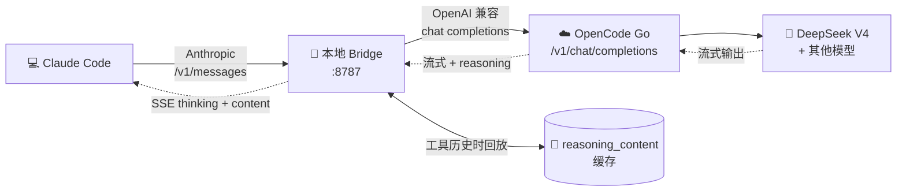

<div align="center">


# DeepSeek V4 OpenCode Claude Code Bridge

**即开即用的本地桥接服务 — 让 Claude Code 稳定使用 OpenCode Go 上的 DeepSeek V4，并完整保留 thinking 模式工具调用所需的 `reasoning_content`。**

[](LICENSE)
[](package.json)
[](#-环境要求)
[](package.json)
[](package.json)
[](https://github.com/superheroYu/deepseek-v4-opencode-claude-code-bridge)

[English](README.md) · [简体中文](README.zh-CN.md)

</div>

---

Claude Code 使用 Anthropic `/v1/messages` 协议。OpenCode Go 通过 OpenAI 兼容的 `/v1/chat/completions` 暴露 DeepSeek V4。本项目在两种协议之间转换，**并且**保存 DeepSeek V4 在 thinking 模式工具调用场景下需要回传的 `reasoning_content` 历史。

> [!NOTE]
> 其他使用 `/v1/chat/completions` 的 OpenCode Go 模型也可能可用，但属于 best-effort/实验性支持 —— 它们的工具调用行为可能和 DeepSeek V4 不完全一致。

---

## 📑 目录

- [🔄 工作原理](#-工作原理)
- [✅ 当前范围](#-当前范围)
- [🎯 为什么不是通用网关？](#-为什么不是通用网关)
- [⚖️ 与 oc-go-cc 的对比](#%EF%B8%8F-与-oc-go-cc-的对比)
- [📋 环境要求](#-环境要求)
- [⚙️ 配置说明](#%EF%B8%8F-配置说明)
- [🚀 启动](#-启动)
- [🔧 开机自启动](#-开机自启动)
- [🛠️ Claude Code 设置](#%EF%B8%8F-claude-code-设置)
- [🩺 健康检查](#-健康检查)
- [📊 用量统计说明](#-用量统计说明)
- [🧪 开发检查](#-开发检查)
- [🐛 故障排查](#-故障排查)
- [🔒 安全说明](#-安全说明)
- [📜 对话压缩](#-对话压缩)
- [💡 为什么需要它](#-为什么需要它)
- [📚 OpenCode Go 说明](#-opencode-go-说明)
- [🔗 参考资料](#-参考资料)

---

## 🔄 工作原理



bridge 转换如下：

| Anthropic Messages API | ⇄ | OpenAI 兼容 Chat Completions |
| --- | :---: | --- |
| `messages[].content`（文本 / `tool_use` / `tool_result`） | → | `messages` 的 `role=user/assistant/tool` |
| `tools[{ name, description, input_schema }]` | → | `tools[{ type: "function", function: { name, description, parameters } }]` |
| `tool_choice` | → | 必要时柔化为 system 指令 |
| SSE `message_*` / `content_block_*` 事件 | → | 流式 chat completion chunk |

对于 DeepSeek V4，bridge 还会保存 thinking 模式工具调用需要的 `reasoning_content`。DeepSeek 要求后续带有历史工具调用的请求必须把对应的 reasoning 内容一起传回去。bridge 把这些内容写入本地缓存，避免 Claude Code 连续会话中出现 `reasoning_content must be passed back` 错误。

---

## ✅ 当前范围

<table>
<tr>
<th width="50%">✅ 已支持</th>
<th width="50%">❌ 不在目标内</th>
</tr>
<tr>
<td valign="top">

- Claude Code `/v1/messages` 非流式 + 流式
- 文本内容
- Claude Code 工具调用和工具结果
- OpenAI 兼容 function calling
- DeepSeek V4 工具调用历史的 `reasoning_content` 回放
- **已验证**：OpenCode Go DeepSeek V4 Pro / Flash
- **实验性**：其他 OpenCode Go `/v1/chat/completions` 模型
- Windows、Linux、macOS（Node.js 运行时）

</td>
<td valign="top">

- 图片、音频、prompt caching、Anthropic beta 字段
- 强制 `tool_choice`（会柔化为 system 指令）
- 非 DeepSeek 模型的 reasoning 回放（默认关闭）
- Anthropic 签名过的 thinking blocks（使用空 `signature`）
- 完整 Anthropic API 兼容 —— 本项目是**兼容桥接**而非替代品

</td>
</tr>
</table>

---

## 🎯 为什么不是通用网关？

ccNexus、LiteLLM、New API、One API 等通用代理项目更适合做多 provider 管理、端点轮换、额度控制、仪表盘、虚拟 key 或统一 OpenAI 兼容入口。它们解决的是“广覆盖”的问题。

本项目刻意做窄，只解决一个具体问题：**让 OpenCode Go 的 DeepSeek V4 可以稳定作为 Claude Code 后端使用。**

| 维度 | 通用转换网关 | **本项目** |
| --- | --- | --- |
| 🎯 主要目标 | 路由或统一多种 provider/API 格式 | 让 OpenCode Go DeepSeek V4 能在 Claude Code 中使用 |
| 📐 范围 | 多 provider、多模型、管理功能更全 | 聚焦 Anthropic Messages → OpenAI chat-completions |
| 🧠 DeepSeek V4 `reasoning_content` 回放 | 通常不是核心设计目标 | **核心能力** —— 本地缓存 + 回放 |
| 💭 Claude Code thinking 显示 | 取决于具体网关和模型路径 | 将 DeepSeek reasoning delta 转成 Anthropic 兼容 thinking block |
| 🔧 工具调用历史 | 通用 tool schema 转换 | 为 Claude Code 工具调用历史恢复 DeepSeek reasoning |
| 🔀 强制 `tool_choice` | 常见做法是直接转 OpenAI forced tool choice | 针对 DeepSeek/OpenCode Go 做柔化 |
| 📦 部署形态 | 通常是完整 gateway，带管理功能 | 单一**零依赖** Node.js 本地 bridge |

本项目的优势不是“更通用”，而是更贴近 DeepSeek V4 的几个特殊约束：

- **🔁 Reasoning 回放** —— DeepSeek thinking 模式下的工具调用历史可能要求把之前的 `reasoning_content` 原样带回。bridge 按 tool call ID、assistant 文本 hash、最近 tool context 三种路径缓存和回放。
- **🗜️ 承受 Claude Code 对话压缩** —— 当 Claude Code 在压缩后仍保留近期 `tool_use`/`tool_result` 块时，bridge 仍能从本地缓存找回对应 reasoning。
- **👀 可见 thinking** —— 流式 DeepSeek `reasoning_content` 会被包装成 Anthropic 兼容 `thinking` content block，让 Claude Code 可以显示思考内容。
- **🧩 DeepSeek-aware 扩展字段** —— `thinking` 和 `reasoning_effort` 只会发给 DeepSeek 模型名，实验性接入其他 chat-completions 模型时不会被 DeepSeek 专用字段污染。
- **🏷️ 贴合 OpenCode Go 模型 ID** —— 默认配置直接使用 OpenCode Go 的 DeepSeek V4 模型 ID，包括 `deepseek-v4-pro[1m]` 和 `deepseek-v4-flash`。

> [!TIP]
> 如果你的目标是多 provider 聚合、团队管理、key 轮换或可视化后台，**通用网关**更合适。
> 如果你的核心问题是“**Claude Code 无法稳定使用 OpenCode Go DeepSeek V4，尤其是工具调用或 thinking 历史之后容易出错**”，**本项目**更对口。

---

## ⚖️ 与 oc-go-cc 的对比

[`oc-go-cc`](https://github.com/samueltuyizere/oc-go-cc) 和 LiteLLM、New API 这类宽泛网关不太一样，它和本项目更接近：同样是把 OpenCode Go 接到 Claude Code，同样会把 Anthropic Messages 请求转换成 OpenAI 风格 chat-completions 请求。

主要区别是**产品重心**：

| | [`oc-go-cc`](https://github.com/samueltuyizere/oc-go-cc) | **本项目** |
| --- | --- | --- |
| 🎯 适用场景 | 更完整的 OpenCode Go 后端管理：模型路由、fallback chain、token 阈值、CLI/后台运行、更广的模型覆盖 | 专门解决 DeepSeek V4 在工具调用、多轮续接或 Claude Code 历史压缩后报 `reasoning_content must be passed back` |
| 💾 Reasoning 缓存 | 核心 thinking/reasoning 协议映射 | 持久化本地 `reasoning_content` 缓存 + 按 tool call ID、assistant 文本 hash、最近 tool context 回放 |
| 📦 体积 | 功能面更广 | 零依赖 Node.js，聚焦 DeepSeek V4 Pro/Flash，MIT 许可证 |

---

## 📋 环境要求

- **Node.js** 18 或更新版本
- **OpenCode Go API key**
- **Claude Code**

> [!NOTE]
> 本项目不需要任何 npm 依赖。

---

## ⚙️ 配置说明

仓库里已经包含可直接使用的 `config.json`。它不包含任何 API key。只有在需要修改端口、上游 URL、模型列表或 reasoning cache 路径时，才需要编辑它。

<details>
<summary><b>默认 <code>config.json</code></b></summary>

```json
{
  "listen": {
    "host": "127.0.0.1",
    "port": 8787
  },
  "upstream": {
    "baseUrl": "https://opencode.ai/zen/go/v1"
  },
  "models": [
    "deepseek-v4-pro[1m]",
    "deepseek-v4-flash"
  ],
  "reasoningContent": "auto",
  "reasoningCacheMaxEntries": 0,
  "reasoningCacheMaxAgeMs": 2592000000,
  "reasoningCacheMaxSizeBytes": 209715200,
  "reasoningCachePath": "~/.claude/deepseek-v4-opencode-claude-code-bridge-reasoning-cache.json",
  "requestBodyLimitBytes": 104857600,
  "upstreamTimeoutMs": 600000
}
```

</details>

**字段说明**

| 字段 | 说明 |
| --- | --- |
| `listen.host` | 本地监听地址。除非明确需要局域网访问，否则保持 `127.0.0.1`。 |
| `listen.port` | 本地监听端口。 |
| `upstream.baseUrl` | OpenAI 兼容上游 base URL。OpenCode Go 使用 `https://opencode.ai/zen/go/v1`。 |
| `models` | 本地 `/v1/models` 返回的模型 ID。 |
| `reasoningContent` | `auto` / `always` / `never`。OpenCode Go 建议保持 `auto`，只对 DeepSeek 模型名回放 reasoning 历史。 |
| `reasoningCacheMaxEntries` | 每个 reasoning cache bucket 的最大条目数。默认 `0` 表示不按条目数裁剪。 |
| `reasoningCacheMaxAgeMs` | cache 条目自最近一次使用后的最长保留时间。默认 `30 天`。设为 `0` 关闭按时间裁剪。 |
| `reasoningCacheMaxSizeBytes` | 序列化后的 cache 文件大小上限。默认 `200 MB`。超出时优先移除最旧条目。 |
| `reasoningCachePath` | 本地 DeepSeek reasoning cache 路径。 |
| `requestBodyLimitBytes` | 接受的最大请求体大小。默认 `100 MB`。 |
| `upstreamTimeoutMs` | 等待 OpenCode Go 上游请求的最长时间。默认 `10 分钟`。 |

> [!IMPORTANT]
> 默认模型使用 `deepseek-v4-pro[1m]` 这个 1M 上下文变体。如果你的 OpenCode Go 套餐不包含这个变体，请把 `config.json` 和 Claude Code settings 里的所有 `deepseek-v4-pro[1m]` 改成 `deepseek-v4-pro`。

---

## 🚀 启动

<details open>
<summary><b>Windows PowerShell</b></summary>

```powershell
npm start
```

</details>

<details>
<summary><b>Windows cmd</b></summary>

```cmd
start.cmd
```

</details>

<details>
<summary><b>Linux / macOS</b></summary>

```bash
chmod +x ./start.sh
./start.sh
```

</details>

> [!TIP]
> 默认情况下，bridge 会从 Claude Code 的 `ANTHROPIC_API_KEY` 请求头接收 OpenCode Go key。请把 OpenCode Go key 放在 **Claude Code settings** 里，不要放进 `config.json`。

也可以显式指定配置文件：

```bash
node server.js --config ./config.json
# 或者
CLAUDE_OPENCODE_PROXY_CONFIG=./config.json node server.js
```

---

## 🔧 开机自启动

项目内置了用户级自启动脚本。它们**不会**保存 API key；bridge 仍然从 Claude Code 请求里接收 OpenCode Go key。

<details>
<summary><b>🪟 Windows — 计划任务 / 启动文件夹 / 托盘</b></summary>

<br/>

Windows 会优先尝试使用当前用户的计划任务，在用户登录后启动。如果 Task Scheduler 拒绝注册任务，脚本会自动退回到当前用户的"启动"文件夹快捷方式：

```powershell
powershell -NoProfile -ExecutionPolicy Bypass -File .\scripts\install-autostart-windows.ps1
```

如果你已经知道当前机器上计划任务会被拒绝，可以直接使用"启动"文件夹模式：

```powershell
powershell -NoProfile -ExecutionPolicy Bypass -File .\scripts\install-autostart-windows.ps1 -Mode StartupShortcut
```

在"启动"文件夹模式下，脚本会优先使用 `nodew.exe`。如果当前 Node.js 安装没有 `nodew.exe`，则使用 `wscript.exe` 加 `scripts/start-hidden-windows.vbs` 隐藏启动，让 bridge 在后台运行，不显示控制台窗口。这个模式不会创建托盘图标。

如果你希望它出现在 Windows 右下角通知区域：

```powershell
powershell -NoProfile -ExecutionPolicy Bypass -File .\scripts\install-autostart-windows.ps1 -Mode StartupTray
```

托盘启动器提供打开 `/health`、把 reasoning cache 裁剪到 `reasoningCacheMaxSizeBytes` 一半、重启 bridge、退出 bridge 的右键菜单。清理 cache 时会先停止 bridge，修改 cache 文件后再重启，避免运行中的内存 cache 把裁剪后的文件覆盖回去。重启和清理会优先通过只允许本机回环访问的 `/shutdown` 端点让 bridge 自行退出，超时后才会强制停止子进程。裁剪动作由 `scripts/trim-reasoning-cache.js` 执行，所以大 cache 文件会交给 Node.js 解析和写回，不会由 PowerShell 直接处理。Windows 托盘图标会优先使用 `assets/app-icon.ico`，`assets/app-icon.png` 作为源 PNG 保留。托盘菜单会跟随 Windows 当前应用明暗主题，并在可用时使用较新的 Segoe UI 字体。

取消自启动：

```powershell
powershell -NoProfile -ExecutionPolicy Bypass -File .\scripts\uninstall-autostart-windows.ps1
```

</details>

<details>
<summary><b>🐧 Linux — <code>systemd --user</code></b></summary>

<br/>

```bash
chmod +x ./scripts/*.sh
./scripts/install-autostart-linux.sh
systemctl --user status deepseek-v4-opencode-claude-code-bridge.service
```

取消自启动：

```bash
./scripts/uninstall-autostart-linux.sh
```

用户级 systemd 服务通常会在用户会话存在后启动。如果你希望它在开机后、用户未登录时也启动，需要手动开启 linger：

```bash
sudo loginctl enable-linger "$USER"
```

如果上游连接需要代理，请在已经设置了 `HTTP_PROXY`、`HTTPS_PROXY`、`ALL_PROXY` 或 `NO_PROXY` 的 shell 里执行安装命令。Linux 安装脚本会把这些代理环境变量写入 systemd 用户服务；如果当前 Node.js 版本支持，还会加上 `--use-env-proxy`，让内置 `fetch` 使用这些代理。`.bashrc`、`.zshrc` 等交互式 shell 启动文件里的代理配置不会被 `systemd --user` 自动继承。

</details>

<details>
<summary><b>🍎 macOS — 用户级 LaunchAgent</b></summary>

<br/>

```bash
chmod +x ./scripts/*.sh
./scripts/install-autostart-macos.sh
```

取消自启动：

```bash
./scripts/uninstall-autostart-macos.sh
```

</details>

如果要使用非默认配置文件路径，Windows 传 `-ConfigPath`，Linux/macOS 设置 `CONFIG_PATH`：

```powershell
.\scripts\install-autostart-windows.ps1 -ConfigPath "D:\path\config.json"
```

```bash
CONFIG_PATH=/path/to/config.json ./scripts/install-autostart-linux.sh
CONFIG_PATH=/path/to/config.json ./scripts/install-autostart-macos.sh
```

---

## 🛠️ Claude Code 设置

创建 Claude Code settings 文件，例如 `~/.claude/settings.opencode-proxy.json`：

```json
{
  "env": {
    "ANTHROPIC_BASE_URL": "http://127.0.0.1:8787",
    "ANTHROPIC_API_KEY": "sk-opencode-go-key",
    "API_TIMEOUT_MS": "3000000",
    "CLAUDE_CODE_DISABLE_NONESSENTIAL_TRAFFIC": "1",
    "CLAUDE_CODE_ATTRIBUTION_HEADER": "0",
    "ANTHROPIC_MODEL": "deepseek-v4-pro[1m]",
    "ANTHROPIC_SMALL_FAST_MODEL": "deepseek-v4-flash",
    "ANTHROPIC_DEFAULT_SONNET_MODEL": "deepseek-v4-pro[1m]",
    "ANTHROPIC_DEFAULT_OPUS_MODEL": "deepseek-v4-pro[1m]",
    "ANTHROPIC_DEFAULT_HAIKU_MODEL": "deepseek-v4-flash",
    "CLAUDE_CODE_SUBAGENT_MODEL": "deepseek-v4-pro[1m]",
    "CLAUDE_CODE_EFFORT_LEVEL": "max"
  }
}
```

上面的示例沿用 DeepSeek 风格配置，通过 `ANTHROPIC_MODEL` 指定主模型。如果保留 `ANTHROPIC_MODEL`，那么在 Claude Code 里切换模型通常只对当前对话有效；新对话仍会回到 `ANTHROPIC_MODEL` 指定的模型。如果你希望 Claude Code 的模型切换器真正控制默认模型映射，请删除 `ANTHROPIC_MODEL`，然后在 Claude Code 的界面或 `/model` 命令里选择模型。Claude Code 会自己维护 `model` 字段。这样 `sonnet` 和 `opus` 会映射到 `deepseek-v4-pro[1m]`，`haiku` 和 small/fast 调用会映射到 `deepseek-v4-flash`。

你可以把这份内容保存成单独的 settings 文件，然后通过 `--settings` 使用；也可以直接用同样内容覆盖 Claude Code 默认的 `~/.claude/settings.json`。直接覆盖默认 settings 通常更简单，因为它可以避免和旧的 `ANTHROPIC_AUTH_TOKEN` 或直连 provider 配置发生合并冲突。

**运行 Claude Code：**

<details open>
<summary><b>Windows PowerShell</b></summary>

```powershell
claude --settings "$HOME\.claude\settings.opencode-proxy.json"
```

</details>

<details>
<summary><b>Linux / macOS</b></summary>

```bash
claude --settings ~/.claude/settings.opencode-proxy.json
```

</details>

**快速测试：**

```powershell
# Windows PowerShell
claude -p "Reply OK only" --max-turns 1 --settings "$HOME\.claude\settings.opencode-proxy.json"
```

```bash
# Linux / macOS
claude -p "Reply OK only" --max-turns 1 --settings ~/.claude/settings.opencode-proxy.json
```

> [!WARNING]
> 如果 Windows 上出现 `Settings file not found`，请传**绝对路径**，不要传 `~`，例如 `C:\Users\<you>\.claude\settings.opencode-proxy.json`。

> [!IMPORTANT]
> 本地 bridge 请使用 `ANTHROPIC_API_KEY`，**不要**使用 `ANTHROPIC_AUTH_TOKEN`。Claude Code 会把 `ANTHROPIC_API_KEY` 作为 `x-api-key` 发送；默认情况下 bridge 会把这个 key 转发给 OpenCode Go。

`CLAUDE_CODE_EFFORT_LEVEL=max` 会让 Claude Code 对所选后端使用最高可用推理努力。如果你更希望响应速度快一些，可以降低或删除它。实际使用中，思考强度不是一个精确可控的旋钮：Claude Code 的会话状态、`/effort`、`effortLevel` 和 `CLAUDE_CODE_EFFORT_LEVEL` 可能互相影响，而 DeepSeek/OpenCode Go 也可能对最终值做归一化。更准确地说，它是“请求的思考强度提示”，不是严格保证的后端档位。

当 Claude Code 在请求体里带上 Anthropic 格式的 `thinking` 和 `output_config.effort` 字段时，bridge 会把它们翻译成 DeepSeek/OpenAI 兼容的 `thinking` 和 `reasoning_effort`，但只对 DeepSeek 模型名这样做。bridge 不会从 `config.json` 强行开启 thinking；单次会话里的 `/effort` 仍然由 Claude Code 自己控制。根据 DeepSeek 的 thinking mode 文档，思考模式默认开启，Claude Code/OpenCode 这类复杂 Agent 请求可能会被按 max effort 的思考请求处理。实际使用中，`/effort` 和 `effortLevel` 会影响 Claude Code 请求的思考强度，但不能保证后端严格按这个档位执行；它们也不是唯一的 thinking 开关。如果 Claude Code 没有发送 `thinking` 字段，bridge 会让 DeepSeek 使用自己的默认行为。为了匹配 DeepSeek V4 的兼容行为，`low` 和 `medium` effort 会按 `high` 发送，`xhigh` 会按 `max` 发送。

当 DeepSeek 返回 `reasoning_content` 时，bridge 会把它包装成 Anthropic 兼容的 `thinking` content block，让 Claude Code 可以显示思考内容。同一份 reasoning 也会继续缓存起来，用于后续 DeepSeek 工具调用历史回放。

**实验其他模型**

要实验其他 `/v1/chat/completions` Go 模型，先把模型 ID 加到 `config.json`，再修改 Claude Code 的模型字段：

```json
{
  "env": {
    "ANTHROPIC_BASE_URL": "http://127.0.0.1:8787",
    "ANTHROPIC_API_KEY": "sk-opencode-go-key",
    "ANTHROPIC_MODEL": "kimi-k2.6",
    "ANTHROPIC_SMALL_FAST_MODEL": "deepseek-v4-flash"
  }
}
```

使用 Go API 原始模型 ID（例如 `deepseek-v4-pro[1m]` 或 `kimi-k2.6`），**不要**使用 OpenCode 应用里的 `opencode-go/<model-id>` 前缀。非 DeepSeek 模型在工具调用行为验证前都应视为 best-effort。

---

## 🩺 健康检查

```bash
curl http://127.0.0.1:8787/health
```

预期结构：

```json
{
  "ok": true,
  "listen": "http://127.0.0.1:8787",
  "upstream": "https://opencode.ai/zen/go/v1/chat/completions",
  "upstream_key_source": "request"
}
```

如果也要探测 OpenCode Go 上游端点，请传入 OpenCode Go key 并加上 `?probe=upstream`：

```bash
curl -H "x-api-key: sk-..." "http://127.0.0.1:8787/health?probe=upstream"
```

---

## 📊 用量统计说明

bridge 会把上游 OpenAI 兼容 usage 转成 Claude Code 能理解的 Anthropic 风格 usage。DeepSeek/OpenCode Go 可能返回 `prompt_tokens`、`completion_tokens`、`prompt_cache_hit_tokens`、`prompt_cache_miss_tokens`。

| Anthropic 字段（上报给 Claude Code） | 数据来源（上游 OpenCode Go） |
| --- | --- |
| `input_tokens` | `prompt_tokens` 或 `input_tokens` |
| `output_tokens` | `completion_tokens` 或 `output_tokens` |
| `cache_read_input_tokens` | `prompt_cache_hit_tokens`（如果存在） |
| `cache_creation_input_tokens` | `prompt_cache_miss_tokens`（如果存在） |

> [!NOTE]
> `cache_creation_input_tokens` 在本项目中是有意保留的兼容性估算。DeepSeek 的 cache miss 表示这些 token 没有从缓存读取，并会按 cache-miss input 计费；上游 API 并不会返回“本次实际写入 Anthropic 风格新缓存条目的 token 数”。bridge 会把 miss 映射到 Claude Code 的 cache-write 字段，让 `/usage` 能看到 DeepSeek 请求中的 cache-miss 侧用量。在本项目里应把 Claude Code 的 `cache write` 理解为 **DeepSeek/OpenCode Go 的 cache-miss input**，而不是权威的 Anthropic cache creation。

流式请求中，上游 usage 通常在最后一个 SSE chunk 才出现。因此 bridge 会先在 `message_start` 中发送 `input_tokens: 0`，最后在 `message_delta` 中补充累计 usage。

> [!TIP]
> Claude Code `/usage` 只能作为 token 视角的翻译统计，**不等于** OpenCode Go 订阅额度。OpenCode Go 的真实用量以 **console** 为准，因为它按美元额度、模型价格和 cached token 规则计算。

---

## 🧪 开发检查

```bash
node --check server.js
node --test
```

---

## 🐛 故障排查

<details>
<summary><b><code>reasoning_content must be passed back</code></b></summary>

保留 reasoning cache 文件，并使用同一个 cache 路径重启 bridge，不要过度裁剪旧条目。如果会话历史里仍然有旧的 DeepSeek 工具调用，但 cache 已经被删除，bridge 只能为缺失 reasoning 发送兼容占位值。这可以避免请求直接失败，但可能降低旧会话续接质量；条件允许时建议新开 Claude Code 会话。

</details>

<details>
<summary><b>reasoning cache 被提前裁剪</b></summary>

默认情况下，超过 30 天未使用的条目会过期，序列化后的 cache 文件也会限制在 200 MB。可以调大 `reasoningCacheMaxAgeMs` 或 `reasoningCacheMaxSizeBytes`，也可以把对应值设为 `0` 来关闭该维度。

</details>

<details>
<summary><b>OpenCode Go 返回 <code>401</code> 或 <code>403</code></b></summary>

检查 Claude Code settings 是否使用 `ANTHROPIC_API_KEY` 填写 OpenCode Go key。这个 bridge 不使用 `ANTHROPIC_AUTH_TOKEN`，也要避免和全局 Claude 登录配置冲突。

</details>

<details>
<summary><b>Claude Code 一直重试直到超时</b></summary>

先访问 `http://127.0.0.1:8787/health` 确认 bridge 正在运行，再用带 `x-api-key` 的 `/health?probe=upstream` 探测 OpenCode Go。只有在上游健康但响应慢时，才考虑调大 `upstreamTimeoutMs`。

</details>

<details>
<summary><b>Claude Code 不显示思考</b></summary>

确认当前使用的是 DeepSeek 模型，并且上游响应确实包含 `reasoning_content`。简单问题可能不会产生可见思考。非 DeepSeek 模型不会收到 DeepSeek thinking 扩展字段。

</details>

<details>
<summary><b>Windows 上出现 <code>Settings file not found</code></b></summary>

请传绝对路径，例如 `"$HOME\.claude\settings.opencode-proxy.json"`，不要传 `~/.claude/...`。

</details>

<details>
<summary><b>端口被占用</b></summary>

停掉已有 bridge 进程，或者修改 `config.json` 里的 `listen.port`，并同步修改 Claude Code settings 里的 `ANTHROPIC_BASE_URL`。

</details>

---

## 🔒 安全说明

> [!CAUTION]
> - 除非你理解风险，否则保持监听地址为 `127.0.0.1`。
> - **不要**把 API key 写进 `config.json`。
> - reasoning cache 可能包含模型推理痕迹，请把它当成**本地私有会话状态**。
> - 如果删除 reasoning cache，继续旧的 DeepSeek 工具调用会话时可能回退到兼容占位值。

---

## 📜 对话压缩

Claude Code 可能会压缩长对话。本项目无法从 Claude Code 的压缩摘要中恢复 DeepSeek 原始 `reasoning_content`，因为 Claude Code 并不会保存这个 DeepSeek 特有字段。

cache 能覆盖的是仍然**可恢复**的情况：

- ✅ 如果压缩移除了旧工具调用块，只保留文字摘要，那些被移除的块不再需要 DeepSeek reasoning 回放。
- ✅ 如果压缩后仍保留近期 `tool_use` 和 `tool_result` 块，并且保留原始 tool call ID，bridge 可以从 cache 中回放对应 reasoning。
- ⚠️ 如果 cache 被删除、手动裁剪，或来自另一个 bridge 实例，旧 DeepSeek 工具调用历史可能回退到兼容占位值。

长期使用时建议保持 reasoning cache 开启，并根据预期会话寿命调整 cache 限制。bridge 无法知道那些当前没有发给它的 Claude Code 历史会话，因此被时间、大小或条目数裁剪的记录之后可能无法恢复。

> [!NOTE]
> v0.2.1 及更新版本写出的 cache 文件使用 **schema version 2**，并为每个条目保存时间戳。旧版 bridge 仍然可以启动，但会忽略 v2 cache 条目。

---

## 💡 为什么需要它

OpenCode Go 通过 `/v1/chat/completions` 暴露许多模型，包括 GLM、Kimi、DeepSeek V4、MiMo 和 Qwen。Claude Code 期望的是 Anthropic 兼容的 `/v1/messages` 协议。这个协议差异导致这些模型虽然能通过 OpenCode Go 调用，却不一定能直接作为 Claude Code 的完整 agent backend 使用。

本项目桥接这个协议差异：

- 🔧 Anthropic tool schema → OpenAI function schema
- 🔄 OpenAI `tool_calls` → Anthropic `tool_use` blocks
- 📥 Claude `tool_result` blocks → OpenAI `tool` messages
- 🧠 DeepSeek 工具调用历史再次发回时，缓存并回放 `reasoning_content`

目标是让 Claude Code 稳定使用 OpenCode Go 上的 DeepSeek V4，并为其他 chat-completions 模型保留 best-effort 路径。这**不是**面向所有 provider 的通用网关。

---

## 📚 OpenCode Go 说明

根据 OpenCode Go 文档，这些 Go 模型使用 `/v1/chat/completions`，并提供 OpenAI 兼容或类似的 chat-completions 接口：

| 系列 | 模型 |
| --- | --- |
| 🧠 DeepSeek | `deepseek-v4-pro[1m]`、`deepseek-v4-flash` |
| 🌌 GLM | `glm-5.1`、`glm-5` |
| 🌙 Kimi | `kimi-k2.6`、`kimi-k2.5` |
| 🎭 MiMo | `mimo-v2-pro`、`mimo-v2-omni`、`mimo-v2.5-pro`、`mimo-v2.5` |
| 🐉 Qwen | `qwen3.6-plus`、`qwen3.5-plus` |

> [!NOTE]
> MiniMax M2.7 和 M2.5 在文档中是 Anthropic `/v1/messages` 模型，所以通常不需要这个 bridge 来接 Claude Code。

要实验非 DeepSeek 模型，可以把它加入 `config.json`：

```json
{
  "models": [
    "deepseek-v4-pro[1m]",
    "deepseek-v4-flash",
    "kimi-k2.6"
  ],
  "reasoningContent": "auto"
}
```

---

## 🔗 参考资料

- 📘 [OpenCode Go 文档](https://opencode.ai/docs/zh-cn/go/) —— OpenCode Go 的模型 ID、API endpoint 和 AI SDK provider 说明。
- 📗 [DeepSeek API 文档](https://api-docs.deepseek.com/zh-cn/) —— DeepSeek 官方 API 概览。
- 🧠 [DeepSeek thinking mode guide](https://api-docs.deepseek.com/guides/thinking_mode) —— `reasoning_content` 行为以及 thinking 模式工具调用历史的回传要求。
- 🔧 [DeepSeek Tool Calls 文档](https://api-docs.deepseek.com/zh-cn/guides/tool_calls) —— DeepSeek function/tool calling 行为。
- 🤖 [Anthropic Messages API](https://platform.claude.com/docs/en/api/messages) —— Claude 兼容客户端期望的 `/v1/messages` 协议结构。
- ⚙️ [OpenAI Function Calling 指南](https://developers.openai.com/api/docs/guides/function-calling) —— OpenAI 风格 function/tool calling 概念。
- 📡 [OpenAI Chat API Reference](https://developers.openai.com/api/reference/resources/chat) —— OpenAI 兼容上游常见的 chat-completions 请求和响应结构。
- 🌉 [ccNexus](https://github.com/lich0821/ccNexus) —— 通用 Claude Code/Codex API 网关，包含端点轮换和多格式转换能力。
- 🌉 [oc-go-cc](https://github.com/samueltuyizere/oc-go-cc) —— 面向 Claude Code 的 OpenCode Go 代理，包含模型路由、fallback chain，以及 DeepSeek V4 thinking/reasoning-content 协议映射。
- 🌉 [LiteLLM](https://github.com/BerriAI/litellm) —— 面向多 LLM provider 的通用 AI gateway，提供 OpenAI 兼容接口。
- 🌉 [New API](https://github.com/QuantumNous/new-api) —— 通用模型聚合与分发网关，支持多种 API 格式互转。

---

<div align="center">

**为 DeepSeek V4 + Claude Code 工作流而生 ❤️**

[⬆ 回到顶部](#deepseek-v4-opencode-claude-code-bridge)

</div>
